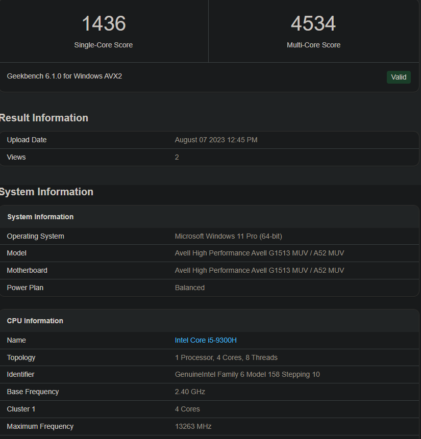
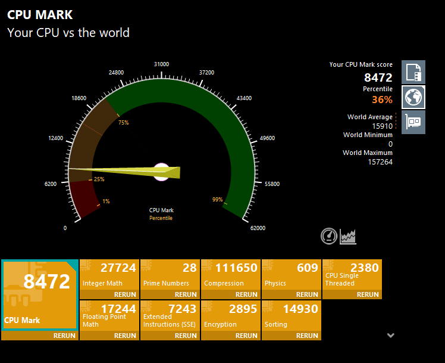
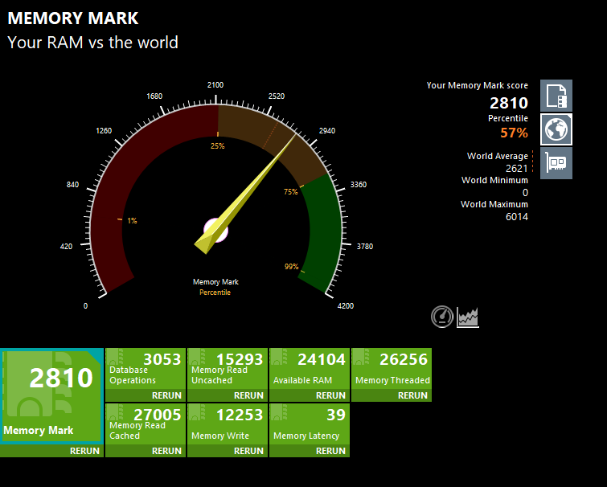
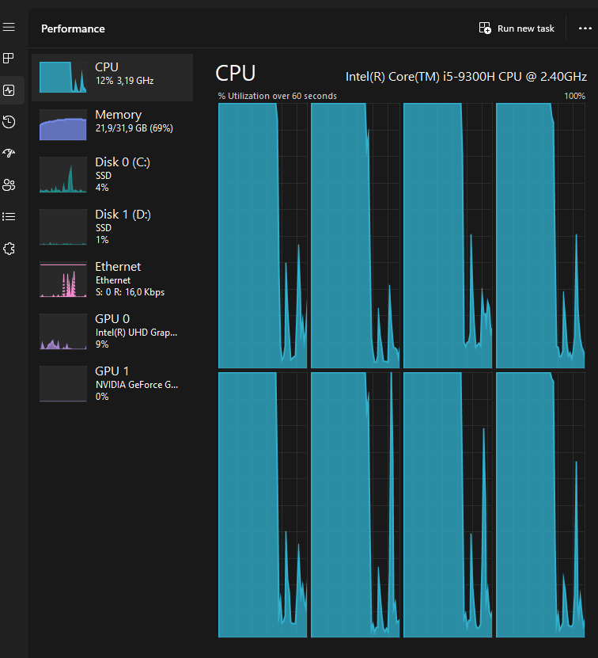
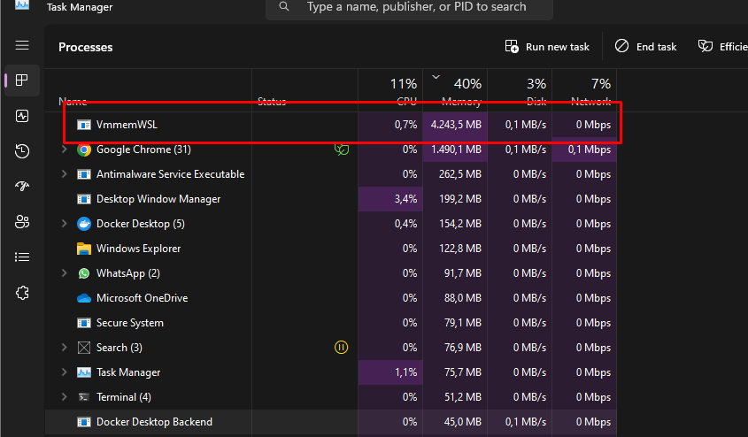
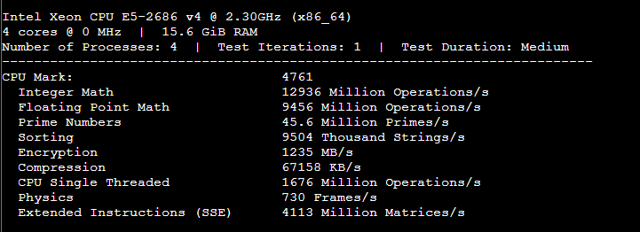
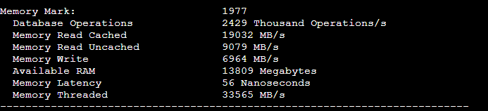
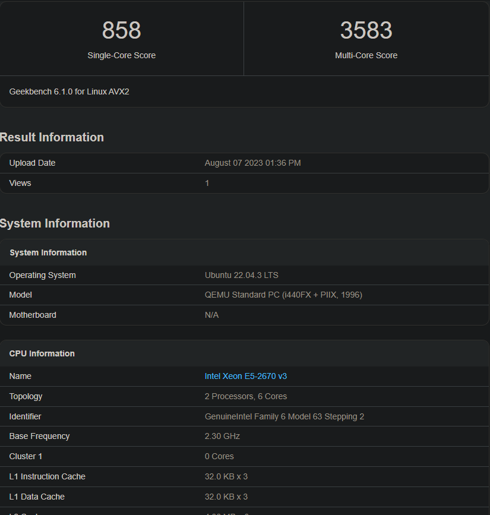
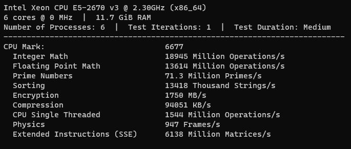
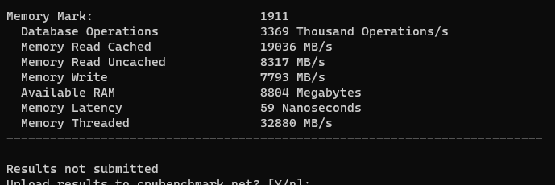

# Resultados dos Testes

## Testes realizados no Laptop do Programador

Teste de CPU do Geekbench.

Teste de CPU do Passmark.

Teste de memória do Passmark.

Alto uso de recursos observados no Laptop do programador executando Windows 11.

## Testes realizados na VM da AWS

Teste de CPU do Geekbench.

Teste de CPU do Passmark.

Teste de memória do Passmark.

## Testes realizados na VM do Proxmox

Teste de CPU do Geekbench.

Teste de CPU do Passmark.

Teste de memória do Passmark.

## Referências
